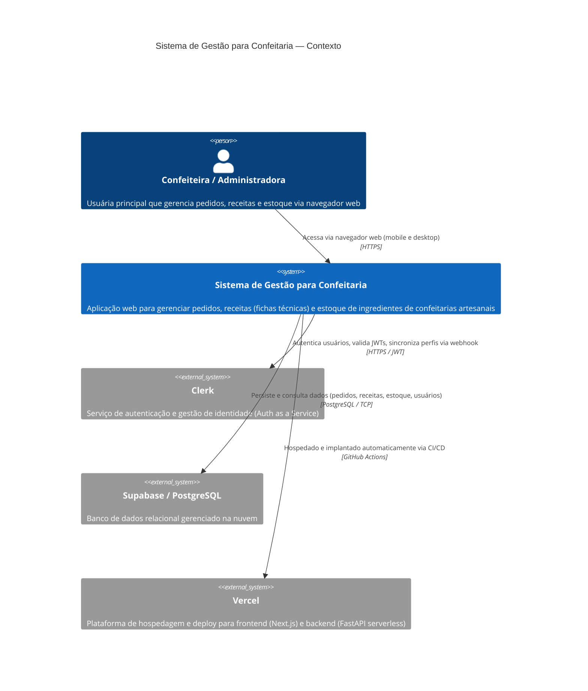
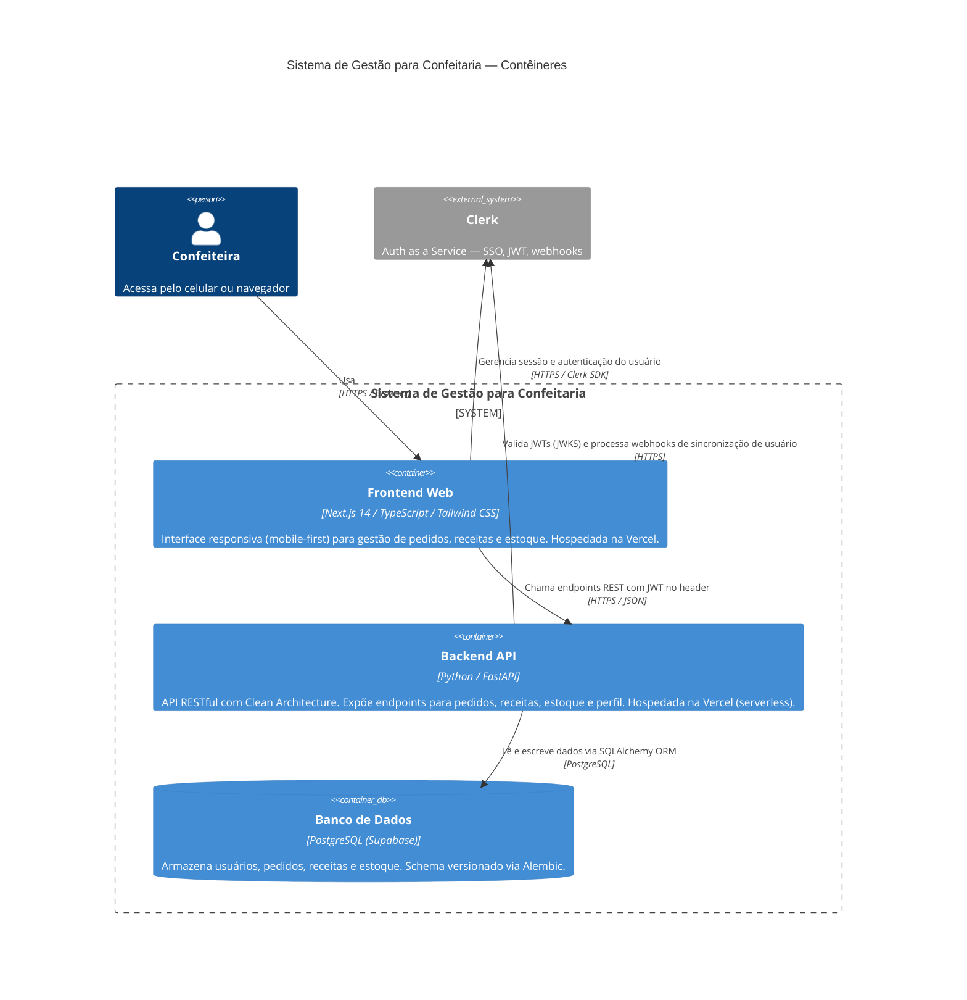
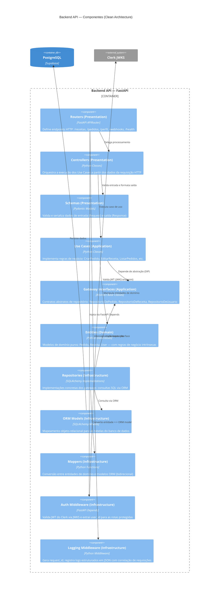
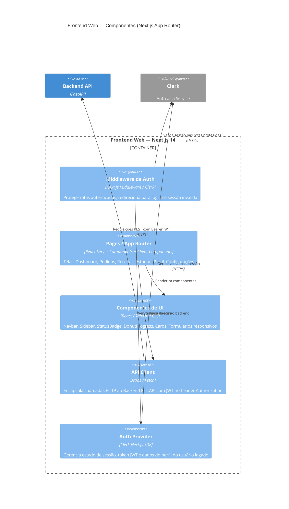
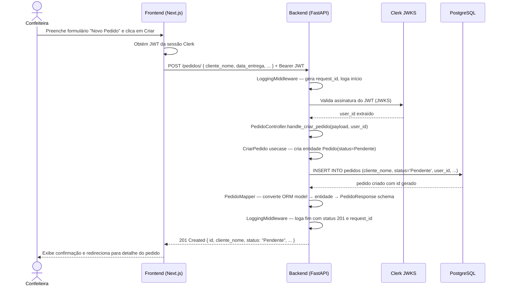

# Modelos C4 — Sistema de Gestão para Confeitaria

> Os diagramas abaixo utilizam sintaxe **Mermaid** (renderizável no GitHub, VS Code e ferramentas compatíveis).

---

## Nível 1 — Diagrama de Contexto do Sistema

Mostra o sistema como uma caixa preta e suas relações com usuários e sistemas externos.

---

## Nível 2 — Diagrama de Contêineres

Mostra os principais contêineres (processos / aplicações) que compõem o sistema.

---

## Nível 3 — Diagrama de Componentes (Backend)

Detalha os principais componentes internos da API FastAPI.

---

## Nível 3 — Diagrama de Componentes (Frontend)

---

## Nível 4 — Diagrama de Código (Fluxo: Criar Pedido)

Sequência simplificada para o caso de uso de maior criticidade do negócio.

---

**Versão:** 1.0
**Data:** 2026-04-20
**Autor:** Equipe de Desenvolvimento
